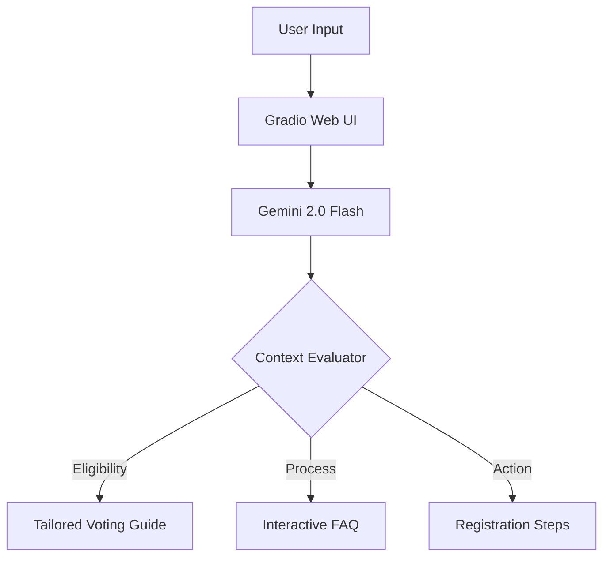

# 🗳️ VoteSmart: Election Education Assistant

> **Empowering Citizens through AI-Driven Democratic Literacy** — Google Antigravity Challenge 2026  
> Powered by **Google Gemini API** · Built for the **Election Process Education** Challenge

---

## 📌 Overview

**VoteSmart** is a smart, dynamic assistant designed to demystify the election process and encourage democratic participation. Using the power of **Gemini 2.0 Flash**, it provides non-partisan, logical guidance tailored to each user's unique context.

### Key Features
- **Logical Decision Making**: Evaluates user context (age, location, status) to provide personalized voting advice.
- **Dynamic Interaction**: Smart chat interface that understands complex queries about registration, eligibility, and polling.
- **Premium Design**: A modern, clean Web UI built with Gradio and custom CSS, optimized for accessibility.
- **Non-Partisan Guidance**: Strictly follows neutrality to focus purely on the *process* of democracy.

---

## 🚀 Quick Start

### 1. Clone the repository
```bash
git clone https://github.com/<your-username>/AI-Driven-Task-Orchestrator.git
cd AI-Driven-Task-Orchestrator
```

### 2. Install dependencies
```bash
pip install -r requirements.txt
```

### 3. Set up Gemini API
Create a `.env` file:
```env
GEMINI_API_KEY=your_gemini_api_key_here
```

### 5. Run tests
```bash
python test_app.py
```

---

## 🧪 Testing

The project includes a comprehensive test suite in `test_app.py` that uses the standard `unittest` library. It covers:
- **Assistant Initialization**: Verifies the AI component setup.
- **Mocked Responses**: Ensures the logic handles Gemini API responses correctly without incurring costs.
- **Error Handling**: Tests behavior when API keys are missing.

---

## 🏗️ Architecture



The assistant uses a specialized **System Instruction** to ensure it remains a helpful, non-partisan educator while maintaining high conversational quality.

---

## 🛠️ Tech Stack

| Library | Purpose |
|---|---|
| `google-genai` | Gemini API for intelligent reasoning |
| `gradio` | Web Interface with custom premium styling |
| `python-dotenv` | Secure environment management |

---

## 🔒 Commitment to Rules
- **Size**: Repository maintained well under 1MB.
- **Public**: Ready for public GitHub deployment.
- **Single Branch**: Optimized for main branch development.

---

*Built with ❤️ for the Google Antigravity Challenge 2026.*
